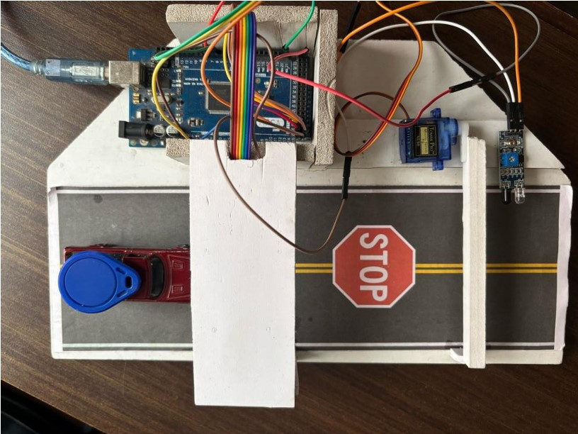
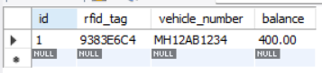
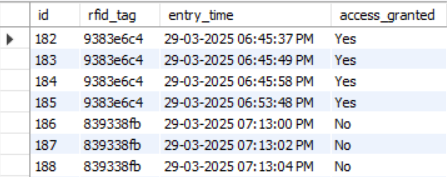
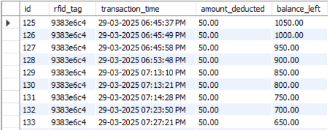

# 🚗 RFID-Based Smart Toll Gate System

An IoT-based automated toll collection system built with **Arduino Mega**, **RC522 RFID Reader**, **Servo Motor**, **Python**, and **MySQL**.

Vehicles are identified using RFID cards, toll charges are deducted automatically, gate access is controlled in real time, and all activity is logged into a MySQL database for monitoring and analysis.

---

## 📹 Demo Video

[](https://youtu.be/79Zq9WFfDxI)

---

## 📸 Project Images

| Hardware Setup |
|:--------------:|
|  |

| Users Table | Gate Entries | Transactions |
|:-----------:|:------------:|:------------:|
|  |  |  |

---

## 📌 Overview

This project demonstrates an automated toll collection system using RFID technology and database integration. Vehicles are identified through RFID tags, validated against a database, charged automatically, and granted or denied access based on authorization status.

### Version 1 – Basic RFID Toll Gate
- RFID authentication with servo-controlled gate
- MySQL database integration
- Toll deduction and transaction logging

### Version 2 – RFID Toll Gate with IR Sensor
- All features of Version 1
- Vehicle passage detection via IR sensor
- Safe gate closure only after vehicle fully crosses the barrier

---

## ✨ Features

- RFID-based vehicle authentication
- Automated toll deduction (₹50 per entry)
- Servo-controlled gate barrier
- Real-time MySQL database logging
- Authorized and unauthorized access detection
- Live monitoring through Python scripts
- Vehicle account balance management
- Transaction history tracking
- Optional IR sensor for safe gate closure

---

## 🛠️ Technologies Used

### Hardware
| Component | Purpose |
|-----------|---------|
| Arduino Mega 2560 | Main microcontroller |
| RC522 RFID Reader | Card scanning |
| RFID Cards / Tags | Vehicle identification |
| Servo Motor | Gate barrier control |
| IR Sensor *(optional)* | Vehicle passage detection |
| Breadboard & Jumper Wires | Circuit connections |

### Software
- Arduino IDE
- Python 3
- MySQL Server
- MySQL Workbench

### Python Libraries
```
pyserial
mysql-connector-python
```

---

## 🏗️ System Architecture
```
RFID Card
    ↓
RC522 RFID Reader
    ↓
Arduino Mega
    ↓
Serial Communication
    ↓
Python Application
    ↓
MySQL Database
    ↓
Access Decision
    ↓
Servo Motor Gate Control
```

---

## 🗃️ Database Structure

### `users` — Registered RFID cards and balances

| Field | Type | Description |
|-------|------|-------------|
| id | INT | Auto-increment primary key |
| rfid_tag | VARCHAR(20) | RFID card UID |
| vehicle_number | VARCHAR(20) | Vehicle registration number |
| balance | DECIMAL(10,2) | Available wallet balance |

### `gate_entries` — Every access attempt

| Field | Type | Description |
|-------|------|-------------|
| id | INT | Auto-increment primary key |
| rfid_tag | VARCHAR(20) | RFID card UID |
| entry_time | VARCHAR(50) | Timestamp of scan |
| access_granted | ENUM('Yes','No') | Access result |

### `toll_transactions` — Successful toll deductions

| Field | Type | Description |
|-------|------|-------------|
| id | INT | Auto-increment primary key |
| rfid_tag | VARCHAR(20) | RFID card UID |
| transaction_time | VARCHAR(50) | Timestamp |
| amount_deducted | DECIMAL(10,2) | Toll charged |
| balance_left | DECIMAL(10,2) | Remaining balance |

---

## 🔌 Hardware Connections

### RC522 RFID Reader → Arduino Mega

| RC522 Pin | Arduino Mega Pin |
|-----------|-----------------|
| SDA (SS) | 53 |
| SCK | 52 |
| MOSI | 51 |
| MISO | 50 |
| RST | 49 |
| 3.3V | 3.3V |
| GND | GND |

### Servo Motor

| Servo Pin | Arduino Pin |
|-----------|------------|
| Signal | D6 |
| VCC | 5V |
| GND | GND |

### IR Sensor *(Version 2 only)*

| IR Sensor Pin | Arduino Pin |
|---------------|------------|
| OUT | D7 |
| VCC | 5V |
| GND | GND |

---

## 📁 Repository Structure

```
RFID-Toll-Gate-System/
│
├── README.md
├── requirements.txt
│
├── Arduino/
│   ├── RFID_Basic/
│   │   └── rfidmysql.ino
│   └── RFID_IR_Version/
│       └── rfidmysqlwithIRsensor.ino
│
├── Python/
│   ├── toll_gate.py
│   ├── live_gate_entries.py
│   └── live_toll_transactions.py
│
├── Database/
│   └── tollgate.sql
│
├── Images/
│   ├── setup.jpg
│   ├── gate_open.jpg
│   ├── users_table.png
│   ├── gate_entries.png
│   ├── transactions.png
│   └── architecture.png
│
└── Docs/
    └── Project_Report.pdf
```

---

## ⚙️ Installation Guide

### 1. Clone Repository

```bash
git clone https://github.com/YOUR_USERNAME/RFID-Toll-Gate-System.git
cd RFID-Toll-Gate-System
```

### 2. Install Python Dependencies

```bash
pip install -r requirements.txt
```

### 3. Create Database

Open MySQL Workbench and run:

```sql
CREATE DATABASE tollgate;
```

Then import the schema:

```
Database/tollgate.sql
```

### 4. Find Your RFID Card UID

Upload the Arduino sketch and open the Serial Monitor. Scan your card — the UID will be printed. Add it to the `users` table in your database.

### 5. Configure Database Credentials

Open the Python files and update your MySQL credentials:

```python
db = mysql.connector.connect(
    host="localhost",
    user="root",
    password="YOUR_PASSWORD",   # ← replace this
    database="TollGate"
)
```

### 6. Upload Arduino Sketch

**Basic Version:**
```
Arduino/RFID_Basic/rfidmysql.ino
```

**With IR Sensor:**
```
Arduino/RFID_IR_Version/rfidmysqlwithIRsensor.ino
```

### 7. Configure Serial Port

In `toll_gate.py`, update the COM port to match your Arduino:

```python
arduino = serial.Serial('COM5', 9600)
# Windows: 'COM3', 'COM5', etc.
# Linux/Mac: '/dev/ttyUSB0', '/dev/ttyACM0'
```

### 8. Run the System

```bash
python Python/toll_gate.py
```

The monitoring windows launch automatically. You can also open them manually:

```bash
python Python/live_gate_entries.py
python Python/live_toll_transactions.py
```

---

## 🔄 Workflow

```

Vehicle Arrives
      ↓
RFID Card Scanned
      ↓
Arduino reads UID → sends to Python via Serial
      ↓
Python checks MySQL database
      ↓
        Authorized?
       /           \
     Yes            No
      ↓              ↓
 Deduct ₹50      Deny Access
      ↓              ↓
 Log Transaction  Log Attempt
      ↓
 Arduino opens gate (servo rotates)
      ↓
 Vehicle passes
      ↓
 Gate closes
 (IR version: waits for sensor to confirm passage)
```

---

## 📚 Learning Outcomes

- Embedded Systems & Arduino Programming
- RFID Technology & Serial Communication
- Python Automation & MySQL Database Design
- IoT System Integration & Real-Time Data Logging
- Hardware-Software interfacing

---

## 🚀 Future Improvements

- LCD Status Display
- Web Dashboard for remote monitoring
- Cloud Database Support
- Mobile Application
- FASTag Simulation
- QR Code Payments
- Automatic Number Plate Recognition (ANPR)
- Analytics Dashboard

---

## 👤 Author

**Ayush kumar singh**  
IoT, Robotics and Automation Enthusiast

[](https://github.com/Cosmic021)

---

## 📄 License

This project is shared for educational and learning purposes.
